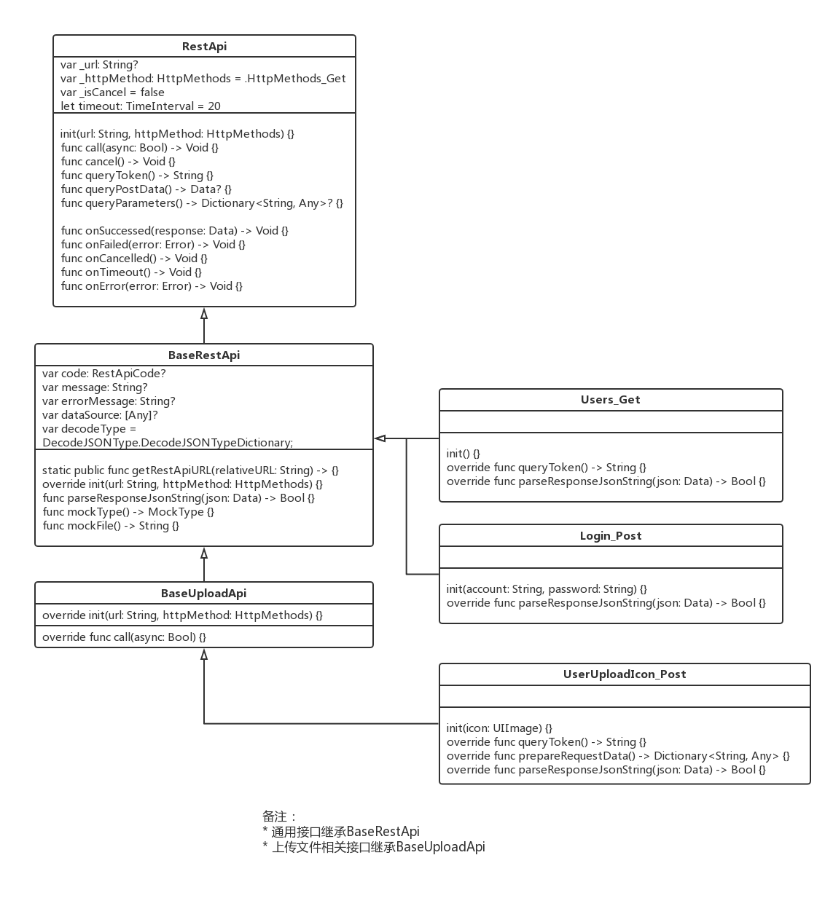

# TemplateSwiftAPP

### 功能清单

1. API：把每个接口都包装成一个独立的API，完成数据请求的整个交互逻辑。支持同步、异步数据请求，配置端口、路径、参数、请求方式(GET/POST/PUT...等)、数据解析、回调、暂停和取消等操作。
2. 模型：存储应用程式数据。支持JSON和Model的相互转换、深复制、自动化编码和解码。
3. 视图：显示模型数据，监听用户交互，需要更新时发送给控制器对象。通过模板方法设计，实现通用的功能，并提供一些子类可扩展的接口
4. 控制器：管理视图和模型的交互逻辑，视图的初始化和释放。支持导航栏标题和图标设置、自定义导航栏、左右标题事件、HUD功能、空页面提示和交互功能、html5页面访问功能、表视图控制器功能、自定义约束、下拉刷新和上拉加载交互功能、表单和分组表视图控制器功能、仿新闻多视图切换控制器功能、导航多视图切换控制器功能。
5. 组件：把很多通用的交互界面定义好完整的接口，使用接口来访问这些功能。比如：登录和注册表单交互、空页面交互、下拉列表交互、多视图标题切换交互、HUD交互...等
6. 工具类：基于外观模式为子系统中的各类（或结构与方法）提供一个简明一致的界面，隐藏子系统的复杂性，使子系统更加容易使用。它是为子系统中的一组接口所提供的一个一致的界面。例如：访问文件系统、数据库文件、APP本地和远程配置、网络状态配置、日期管理、谓词...等
7. 宏定义：定义APP字体和颜色、设备型号、第三方Key...等
8. 第三方SDK：推送、分享、统计分析、地图...等功能的访问

### 库使用

```
    pod 'SwiftyJSON'                    # json 解析 https://github.com/SwiftyJSON/SwiftyJSON
    pod 'SQLite.swift'                  # SQLite https://github.com/stephencelis/SQLite.swift.git
    pod 'Alamofire'                     # 网络请求 https://github.com/Alamofire/Alamofire，同 AFNetworking
    pod 'SnapKit'                       # 布局框架 https://github.com/SnapKit/SnapKit，同 Masonry
    pod 'HandyJSON'                     # 模型转换 https://github.com/alibaba/HandyJSON.git，同MJExtension
    
    pod 'Kingfisher'                    # 缓存图片 https://github.com/onevcat/Kingfisher，同 SDWebImage
    pod 'IBAnimatable'                  # 设计原型，自定义 UI，交互，导航，转场和动画 https://github.com/IBAnimatable/IBAnimatable
    pod 'RxSwift'                       # 响应式编程框架 https://github.com/ReactiveX/RxSwift
    pod 'BMPlayer'                      # 视频播放框架 https://github.com/BrikerMan/BMPlayer
    pod 'SVProgressHUD', '~> 2.1.2'     # 提示功能 https://github.com/SVProgressHUD/SVProgressHUD
    pod 'MJRefresh'                     # 上拉和下拉刷新框架 https://github.com/CoderMJLee/MJRefresh

```

### 目录结构


### 实战

##### 这边文章基于Swift语言，基于框架的方式来快速的构建自己的APP，从组件化、模型、界面、控制器封装、接口封装，到设计模式的使用，同时会集成一些常用的第三方库和SDK。同时尽量把各个功能都封装在一个独立的模块中，降低代码重复量，简单并且唯一，通过接口的方式去访问。同时可以更容易添加单元测试。

##### 这个项目中会实现很多APP开发所需要的通用的功能和组件，同时让你很容易地扩展自己的组件、功能和特性，而不会对系统有影响。目的在于提供一套统一的解决方案，你可以专注于业务模块。欢迎指正。

#### 从零开始


`Xcode 9.2` `Swift 4.0`

[初始工程](Resource/TemplateSwiftAPP(初始).zip)，它包含了一个空项目，同时添加了CocoaPods管理，下载完成打开`TemplateSwiftAPP.xcworkspace`可直接编译。或者使用命令`pod update` 更新之后再打开

#### 1. 接口封装



我们的思想是基于REST Api方式，把每个接口都包装成独立的模块。每个**NSURLSession**的请求中，不同的只是参数、请求方式(GET/POST/PUT...)、接口路径、返回的数据。那我们是不是可以把不同的参数通过多态(重写父类的方法)来实现。而请求数据完成，通过block、代理或重写来处理不同的结果。这里的结果一般的是json数据，同时就可以把json转换成model传递给相应的控制器对象。你会发现我们的请求过程会特别的简单、方便。

> 如何实现?

1. 定义**RestApi**，一个抽象类。包含：初始化、执行、取消、结果处理、参数、日志统计...等方法。一些是子类必须要实现的方法(参数、结果处理)
2. 定义**BaseRestApi**，继承RestApi。定义错误码、解码类型、结果处理方法
3. 定义**BaseUploadApi**，继承**BaseRestApi**，上传图片基类
4. 定义**Users_Get**，继承**BaseRestApi**。定义初始化方法、请求参数、处理结果方法


> 客户端代码

```
let api = Users_Get.init()
api.call(async: true)
        
if api.code == .RestApi_OK {
	self.dataSource = api.dataSource
}

```

#### 2. 模型

Swift 4.0之后，苹果推出支持了json->model的转换。通过Codable可以直接将json转成对象

```
class User: Codable {
    
    var name: String = ""
    var phone: String = ""
    var name_spell: String = ""
    var user_id: String = ""
    var avatar_url: String = ""
    
    /// 如果我们需要用不同的名称, 只需要提供我们自己的 CodingKey
    enum CodingKeys: String,CodingKey {
        case user_id = "userid"
        case name
        case name_spell
        case phone
        case avatar_url
    }
}
```

> 客户端代码

```
if let result = try? JSONDecoder().decode([User].self, from: json) {
            // 解析成功，赋值给:users对象
            self.dataSource = result
        }
```

#### TODO

#### 3. 视图

### 技术总结

